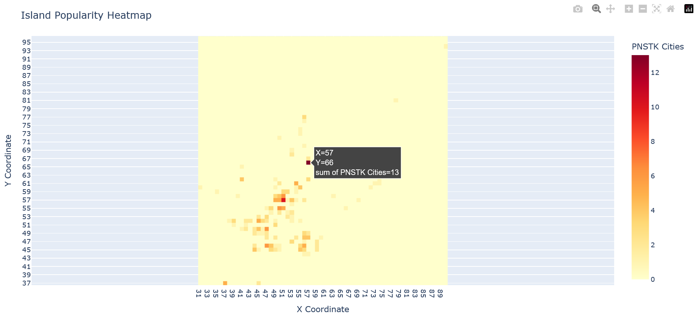

# Heatmap Generator

## Overview

The **Heatmap Generator** is a Python-based tool designed to create interactive heatmaps and cluster islands based on player city data. It retrieves data from the Ikalogs map site and visualizes the distribution of cities, allowing for dynamic heatmap generation and customizable clustering of nearby islands.

## Features

### 1. Interactive Heatmap
- **Dynamic Sizing**: The heatmap adjusts based on the range of coordinates from the data.
- **Hover Details**: Hover over any cell to view the number of cities and the exact coordinates.

### 2. Island Clustering
- **Cluster Nearby Islands**: Islands are grouped into clusters if they are within a specified distance and have a minimum number of cities.
- **Configurable Parameters**: Control the distance between islands and the minimum number of cities for clustering through the `user_config.json` file.

## Data Source

The data is extracted from the Ikalogs map website. Due to JavaScript rendering, the data cannot be fetched directly via HTML parsing, so Selenium is used to simulate user interaction and scrape the data. The default configuration uses the Firefox Driver.

### Data Caching
After the initial data fetch, the parsed data is stored in `{alliance_name}.json`. To fetch new data, delete the JSON file and re-run the script.

## Configuration

You can configure the script by editing the `user_config.json` file. Available settings include:

- **`alliance_name`**: The name of the alliance to fetch data for.
- **`browser_type`**: The browser Selenium will use for scraping. Supported browsers: `chrome`, `chromium`, `firefox`, `brave`, `edge`, `opera`.
- **`max_cluster_distance`**: Maximum distance (in island coordinates) between islands to be considered part of the same cluster.
- **`min_cities_on_island_for_cluster`**: Minimum number of cities required on an island for it to be included in a cluster.
- **`min_total_cities_for_cluster`**: Minimum number of cities in a cluster to include it in the final results.

## Getting Started

1. **Install Dependencies**:
   Make sure you have Python 3.10+ and pip installed. Then, install the required packages:
   ```bash
   pip install -r requirements.txt
   ```


2. **Configure Settings**:
   Update the `user_config.json` file with your alliance name and clustering settings.


3. **Run the Script**:
   Execute the `code/generator.py` file to generate the heatmap and perform clustering:
   ```bash
   python code/generator.py
   ```

4. **View the Results**:
   - Results for the island clustering can be viewed inside the `data/{alliance_name}_island_clusters.md` file.
   - Results for the heatmap can be viewed in the browser (a new tab should have opened up for you with the plotly heatmap)

## Results Examples
#### City clusters results:
```
# City Clusters:
#### City Cluster A - total of 14
- 39:48 -> 5 cities
- 38:48 -> 9 cities

#### City Cluster B - total of 15
- 56:49 -> 6 cities
- 57:49 -> 9 cities

#### City Cluster C - total of 14
- 50:51 -> 5 cities
- 50:50 -> 9 cities

#### City Cluster D - total of 12
- 37:60 -> 6 cities
- 37:59 -> 6 cities

#### City Cluster E - total of 12
- 53:52 -> 12 cities

#### City Cluster F - total of 19
- 56:51 -> 13 cities
- 55:52 -> 6 cities

#### City Cluster G - total of 23
- 59:50 -> 13 cities
- 60:51 -> 4 cities
- 59:52 -> 6 cities
```

#### Heatmap Results:

